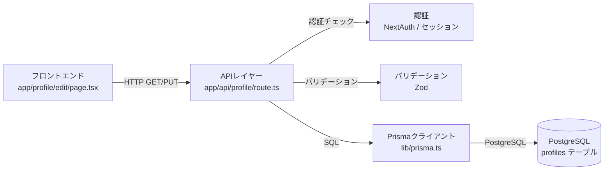

# 実装計画: プロフィール編集機能

## 概要

静的画面で確認済みのプロフィール編集画面（名前・アイコンURL・自己紹介フィールド）をもとに、バックエンド機能・API・DBスキーマ・タスク分解を設計する。

**技術スタック**: Next.js (App Router) + TypeScript + PostgreSQL + Prisma

---

## 1. 画面要件からバックエンド機能を逆算

### 必要なデータの種類と構造

プロフィール編集画面には以下のフィールドがある:

- **名前** (name): ユーザーの表示名。文字列型。
- **アイコンURL** (avatarUrl): プロフィール画像のURL。文字列型（URL形式）。
- **自己紹介** (bio): 自由記述テキスト。文字列型（長文対応）。

### データの取得・更新のタイミング

| 操作 | タイミング | 処理 |
|------|-----------|------|
| プロフィール取得 | 画面表示時 | ログイン中ユーザーの現在値を返す |
| プロフィール更新 | フォーム送信時 | 入力値をDBに保存し更新後の値を返す |

### リアルタイム性

不要。通常の HTTP リクエスト/レスポンスで十分。

### 認証・認可の要件

- プロフィール取得: **認証必須**（自分のプロフィールのみ取得）
- プロフィール更新: **認証必須**（自分のプロフィールのみ更新可能）
- 他ユーザーのプロフィールへのアクセスは本スコープ外

---

## 2. API 定義

### GET /api/profile

- **目的**: ログイン中ユーザーの現在のプロフィール情報を取得する
- **リクエスト**: なし（セッション/トークンからユーザーIDを特定）
- **レスポンス**:
  ```json
  {
    "id": "string",
    "name": "string",
    "avatarUrl": "string | null",
    "bio": "string | null",
    "updatedAt": "string (ISO8601)"
  }
  ```
- **認証**: 要
- **エラーレスポンス**:
  - `401 Unauthorized`: 未認証
  - `404 Not Found`: プロフィールが存在しない

---

### PUT /api/profile

- **目的**: ログイン中ユーザーのプロフィール情報を更新する
- **リクエストボディ**:
  ```json
  {
    "name": "string",
    "avatarUrl": "string | null",
    "bio": "string | null"
  }
  ```
- **レスポンス**:
  ```json
  {
    "id": "string",
    "name": "string",
    "avatarUrl": "string | null",
    "bio": "string | null",
    "updatedAt": "string (ISO8601)"
  }
  ```
- **認証**: 要
- **バリデーション**:
  - `name`: 必須、1文字以上50文字以内
  - `avatarUrl`: 任意、URL形式（`https://` で始まること）、255文字以内
  - `bio`: 任意、500文字以内
- **エラーレスポンス**:
  - `400 Bad Request`: バリデーションエラー（エラー詳細を含む）
  - `401 Unauthorized`: 未認証

---

## 3. DB スキーマ設計（論理設計）

### テーブル設計

#### users テーブル（既存 or 新規）

ユーザーの認証情報を管理するテーブル。既存プロジェクトに `users` テーブルがある場合はそちらを拡張する。

| カラム名 | 型 | NULL | デフォルト | 説明 |
|---------|-----|------|-----------|------|
| id | String (UUID) | NO | cuid() | PK |
| email | String | NO | - | メールアドレス（ユニーク） |
| createdAt | DateTime | NO | now() | 作成日時 |
| updatedAt | DateTime | NO | - | 更新日時（自動更新） |

#### profiles テーブル（新規）

ユーザーのプロフィール情報を管理するテーブル。`users` と 1対1 のリレーション。

| カラム名 | 型 | NULL | デフォルト | 説明 |
|---------|-----|------|-----------|------|
| id | String (UUID) | NO | cuid() | PK |
| userId | String | NO | - | FK → users.id（ユニーク） |
| name | String | NO | - | 表示名（50文字以内） |
| avatarUrl | String | YES | NULL | アイコン画像URL（255文字以内） |
| bio | String | YES | NULL | 自己紹介文（500文字以内） |
| createdAt | DateTime | NO | now() | 作成日時 |
| updatedAt | DateTime | NO | - | 更新日時（自動更新） |

### Prisma スキーマ（論理設計）

```prisma
model User {
  id        String   @id @default(cuid())
  email     String   @unique
  createdAt DateTime @default(now())
  updatedAt DateTime @updatedAt

  profile   Profile?
}

model Profile {
  id        String   @id @default(cuid())
  userId    String   @unique
  name      String   @db.VarChar(50)
  avatarUrl String?  @db.VarChar(255)
  bio       String?  @db.Text
  createdAt DateTime @default(now())
  updatedAt DateTime @updatedAt

  user      User     @relation(fields: [userId], references: [id], onDelete: Cascade)
}
```

### リレーション

- `User` has one `Profile`
- `Profile` belongs to `User`

---

## 4. タスク分解

### タスク1: DB マイグレーション（profiles テーブル作成）

- **対象**: `prisma/schema.prisma`、`prisma/migrations/`
- **内容**:
  - `Profile` モデルを Prisma スキーマに追加
  - `prisma migrate dev` でマイグレーションファイルを生成・適用
- **依存**: なし

---

### タスク2: プロフィール取得 API の実装

- **対象**: `app/api/profile/route.ts`
- **内容**:
  - `GET /api/profile` ハンドラを実装
  - 認証チェック（セッションからユーザーIDを取得）
  - Prisma で `profiles` テーブルからデータを取得
  - レスポンス形式に合わせて JSON を返す
- **依存**: タスク1

---

### タスク3: プロフィール更新 API の実装

- **対象**: `app/api/profile/route.ts`
- **内容**:
  - `PUT /api/profile` ハンドラを実装
  - 認証チェック
  - リクエストボディのバリデーション（Zod を使用）
  - Prisma で `profiles` テーブルをアップサート（`upsert`）
  - 更新後のデータを JSON で返す
- **依存**: タスク2

---

### タスク4: フロントエンドとの統合（API クライアント実装）

- **対象**: `app/profile/edit/page.tsx`（既存静的実装）、`lib/api/profile.ts`（新規）
- **内容**:
  - `lib/api/profile.ts` に `getProfile` / `updateProfile` 関数を作成
  - 静的画面の初期値をAPIから取得するよう修正（`useEffect` or `Server Component` の `fetch`）
  - フォーム送信時に `PUT /api/profile` を呼び出すよう修正
  - 成功・エラー時のフィードバック表示（トースト通知など）
- **依存**: タスク3

---

## 5. 責務の分離



| レイヤー | 責務 | 技術 |
|---------|------|------|
| フロントエンド | UI表示・フォーム操作・API呼び出し | Next.js App Router, TypeScript |
| APIレイヤー | 認証確認・バリデーション・ビジネスロジック | Next.js Route Handlers |
| DBアクセス | データの永続化・取得 | Prisma + PostgreSQL |

---

## 次のステップ

実装計画が確定したら **「5. テストコード作成 (`dev-test-creation`)」** に移行する。

以下のテスト対象が想定される:

- `GET /api/profile` の正常系・未認証エラー系
- `PUT /api/profile` の正常系・バリデーションエラー系・未認証エラー系
- Prisma を用いたDB操作のユニットテスト（モック使用）
