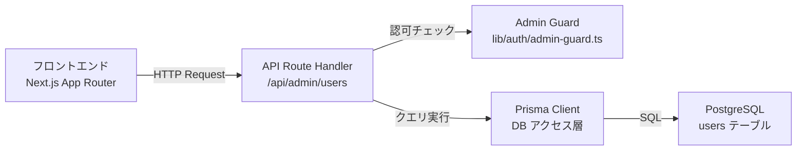

# 管理者ユーザー管理機能 実装計画

## 概要

管理者が一般ユーザーの一覧取得・検索・停止を行うための管理機能を実装する。
技術スタック: Next.js（App Router）+ TypeScript + PostgreSQL + Prisma

---

## 1. 画面要件からバックエンド機能を逆算

### 必要なデータの種類と構造

- ユーザー一覧（ID・名前・メール・ステータス・登録日・最終ログイン日）
- ユーザー停止状態（active / suspended）
- 検索条件（名前・メール・ステータスによるフィルタリング）

### データの取得・更新タイミング

- 一覧表示時: ページロード時にユーザー一覧を取得
- 検索時: 検索条件変更時にユーザー一覧を再取得
- 停止操作時: 管理者が停止ボタンを押した時点でステータスを更新

### リアルタイム性

- 不要（HTTP リクエスト/レスポンスで完結）

### 認証・認可

- 管理者ロール（role: "ADMIN"）を持つユーザーのみアクセス可能
- セッション認証が必要

---

## 2. API 定義

### GET /api/admin/users

- 目的: ユーザー一覧を取得する（検索・フィルタリング対応）
- 認証: 要（管理者ロール必須）
- リクエストクエリパラメータ:
  - `page` (number, optional): ページ番号（デフォルト: 1）
  - `limit` (number, optional): 1ページあたりの件数（デフォルト: 20）
  - `search` (string, optional): 名前またはメールアドレスの部分一致検索
  - `status` (string, optional): `active` / `suspended` / `all`（デフォルト: `all`）
- レスポンス:
  ```json
  {
    "users": [
      {
        "id": "string",
        "name": "string",
        "email": "string",
        "status": "active | suspended",
        "createdAt": "ISO8601",
        "lastLoginAt": "ISO8601 | null"
      }
    ],
    "pagination": {
      "total": "number",
      "page": "number",
      "limit": "number",
      "totalPages": "number"
    }
  }
  ```

### PATCH /api/admin/users/[userId]/suspend

- 目的: 指定ユーザーを停止または停止解除する
- 認証: 要（管理者ロール必須）
- リクエストボディ:
  ```json
  {
    "suspended": true
  }
  ```
- レスポンス:
  ```json
  {
    "id": "string",
    "status": "active | suspended",
    "updatedAt": "ISO8601"
  }
  ```
- バリデーション:
  - `userId` が存在するユーザーであること
  - 自分自身を停止できないこと
  - `suspended` が boolean 型であること

### GET /api/admin/users/[userId]

- 目的: ユーザー詳細を取得する
- 認証: 要（管理者ロール必須）
- レスポンス:
  ```json
  {
    "id": "string",
    "name": "string",
    "email": "string",
    "status": "active | suspended",
    "role": "string",
    "createdAt": "ISO8601",
    "lastLoginAt": "ISO8601 | null",
    "suspendedAt": "ISO8601 | null",
    "suspendedBy": "string | null"
  }
  ```

---

## 3. DB スキーマ設計（論理設計）

### 既存テーブルの拡張: `users`

既存の users テーブルに以下カラムを追加する想定:

| カラム名 | 型 | NULL | デフォルト | 説明 |
|---------|-----|------|-----------|------|
| id | String (UUID) | NO | cuid() | PK |
| name | String | NO | - | 表示名 |
| email | String | NO | - | メールアドレス（UNIQUE） |
| role | Enum(UserRole) | NO | USER | ロール（USER / ADMIN） |
| status | Enum(UserStatus) | NO | ACTIVE | ステータス（ACTIVE / SUSPENDED） |
| suspended_at | DateTime | YES | NULL | 停止日時 |
| suspended_by | String | YES | NULL | 停止した管理者のユーザーID（FK: users.id） |
| last_login_at | DateTime | YES | NULL | 最終ログイン日時 |
| created_at | DateTime | NO | now() | 作成日時 |
| updated_at | DateTime | NO | now() | 更新日時 |

### Enum 定義

```
UserRole: USER, ADMIN
UserStatus: ACTIVE, SUSPENDED
```

### Prisma スキーマ（追加・変更部分）

```prisma
enum UserRole {
  USER
  ADMIN
}

enum UserStatus {
  ACTIVE
  SUSPENDED
}

model User {
  id            String      @id @default(cuid())
  name          String
  email         String      @unique
  role          UserRole    @default(USER)
  status        UserStatus  @default(ACTIVE)
  suspendedAt   DateTime?
  suspendedById String?
  suspendedBy   User?       @relation("SuspendedBy", fields: [suspendedById], references: [id])
  suspendedUsers User[]     @relation("SuspendedBy")
  lastLoginAt   DateTime?
  createdAt     DateTime    @default(now())
  updatedAt     DateTime    @updatedAt

  @@index([status])
  @@index([email])
}
```

### リレーション

- `users` self-relation: `suspendedBy` - 管理者ユーザーが一般ユーザーを停止した記録

---

## 4. タスク分解

### タスク1: DBスキーマ変更・マイグレーション

- 対象: `prisma/schema.prisma`、`prisma/migrations/`
- 内容:
  - `UserRole` / `UserStatus` Enum を追加
  - `users` テーブルに `status`、`suspendedAt`、`suspendedById`、`lastLoginAt` カラムを追加
  - `prisma migrate dev` でマイグレーションファイルを生成
- 依存: なし

### タスク2: 管理者認可ミドルウェア実装

- 対象: `src/lib/auth/admin-guard.ts`（新規）
- 内容:
  - セッションからユーザーロールを取得する関数を実装
  - 管理者でない場合に 403 エラーを返すヘルパー関数を実装
  - App Router の Route Handler で使用できる形式にする
- 依存: タスク1

### タスク3: ユーザー一覧取得API実装

- 対象: `src/app/api/admin/users/route.ts`（新規）
- 内容:
  - GET ハンドラを実装
  - クエリパラメータ（page, limit, search, status）のバリデーション
  - Prisma で検索・ページネーション付きクエリを実装
  - 管理者認可チェックを適用
- 依存: タスク1、タスク2

### タスク4: ユーザー詳細取得API実装

- 対象: `src/app/api/admin/users/[userId]/route.ts`（新規）
- 内容:
  - GET ハンドラを実装
  - userId が存在しない場合は 404 を返す
  - 管理者認可チェックを適用
- 依存: タスク1、タスク2

### タスク5: ユーザー停止API実装

- 対象: `src/app/api/admin/users/[userId]/suspend/route.ts`（新規）
- 内容:
  - PATCH ハンドラを実装
  - リクエストボディのバリデーション（zod を使用）
  - 自分自身への停止を禁止するチェック
  - `status`・`suspendedAt`・`suspendedById` を更新
  - 管理者認可チェックを適用
- 依存: タスク1、タスク2

### タスク6: 管理画面 ユーザー一覧ページ実装

- 対象: `src/app/admin/users/page.tsx`（新規）
- 内容:
  - Server Component でユーザー一覧を取得・表示
  - 検索フォーム（名前・メール・ステータスフィルタ）
  - ページネーション UI
  - 停止/有効化ボタン（Server Action または Client Component）
- 依存: タスク3、タスク5

### タスク7: 管理画面レイアウト・ルーティング設定

- 対象: `src/app/admin/layout.tsx`（新規）
- 内容:
  - 管理者レイアウト（サイドバー・ヘッダー）
  - 管理者ロールチェック（非管理者はリダイレクト）
- 依存: タスク2

---

## 5. 責務の分離



| 層 | 責務 |
|----|------|
| フロントエンド（Page/Component） | 画面表示・ユーザー操作受付・APIコール |
| API Route Handler | リクエストバリデーション・認可チェック・レスポンス整形 |
| Prisma Client | DBクエリ実行・型安全なデータアクセス |
| PostgreSQL | データの永続化・インデックスによる検索最適化 |

---

## 次のステップ

実装計画が確定したら、`dev-test-creation` スキルを使用してテストコードを作成してください。

テスト対象:
- 管理者認可チェックのユニットテスト
- 各 API エンドポイントの統合テスト（正常系・異常系）
- ユーザー一覧ページの E2E テスト（検索・停止操作）
