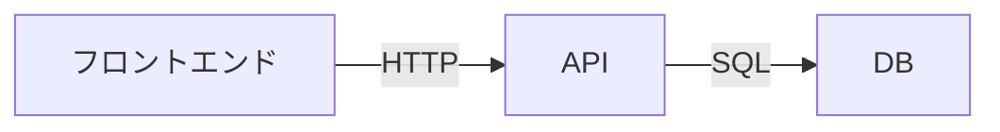

## 概要

静的画面で確認済みの画面仕様をもとに、バックエンド機能・API・DBスキーマ・タスク分解を設計する。画面要件から必要なバックエンド機能を逆算することが重要。

## 前提条件

以下のいずれかが完了していること:
- `dev-static-screen` で静的画面がユーザーに承認されている
- `dev-requirements` で画面不要と判断されている

未完了の場合はエラーとして処理し、先にそちらを実行するよう促す。

## 手順

### 1. 画面要件からバックエンド機能を逆算

静的画面・画面要件を見て、以下を特定する:

- 必要なデータの種類と構造
- データの取得・更新・削除のタイミング
- リアルタイム性の要否（WebSocket / Polling）
- 認証・認可の要件

### 2. API 定義の設計

論理設計レベルで API を定義する:

```
## API 一覧

### GET /api/[resource]
- 目的: [何をするか]
- リクエスト: [パラメータ]
- レスポンス: [返すデータ構造]
- 認証: 要/不要

### POST /api/[resource]
- 目的: [何をするか]
- リクエストボディ: [フィールド一覧]
- レスポンス: [返すデータ構造]
- バリデーション: [ルール]
```

新規機能なら新規設計、既存機能の修正なら既存 API の拡張方針を明示する。

### 3. DB スキーマ設計（論理設計）

論理レベルでテーブル・カラム・リレーションを定義する:

```
## テーブル設計

### [テーブル名]
| カラム名 | 型 | NULL | デフォルト | 説明 |
|---------|-----|------|-----------|------|
| id | bigint | NO | AUTO | PK |
| ... | ... | ... | ... | ... |

### リレーション
- [テーブルA] has many [テーブルB]
- [テーブルA] belongs to [テーブルC]
```

### 4. タスク分解

Issue 単位で実装タスクを分解する。1タスク = 1コミットを意識した粒度:

```
## タスク一覧

### タスク1: [タスク名]
- 対象: [ファイル/機能]
- 内容: [実装すること]
- 依存: [前提となるタスク]

### タスク2: [タスク名]
...
```

### 5. 責務の分離確認

フロントエンド・バックエンド・ストレージそれぞれの責務を明示し、境界を整理する。

## 成果物

### 必須（Markdown に記録）

`docs/implementation-plan/[機能名].md` に実装計画ドキュメントを作成:

- API インターフェース定義
- DB スキーマ（論理設計）
- タスク分解リスト

### 状況に応じて（Markdown に記録）

アーキテクチャ図（責務分離・データフロー）が複雑な場合は Mermaid 図で記録:



## 次のステップ

実装計画が確定したら「5. テストコード作成 (`dev-test-creation`)」への移行を提案する。
