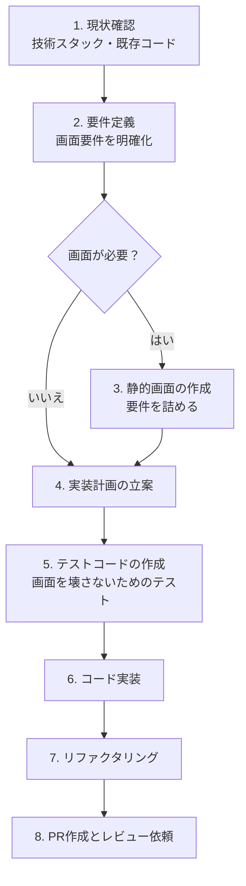

# AI駆動開発ワークフローのたたき台
## 前提
- Web開発を前提とする
- ドキュメントではなく実際のコードを正とする
  - ドキュメントはあくまで補助
- AIに与える以下の情報を事前準備
  - 技術スタック・バージョン
  - プロジェクト構造・ディレクトリ構成
  - 命名規則・コーディング規約
  - 既存コードのパターン・慣例
  - 使用ライブラリ・ツール

## コンセプト
- 画面駆動開発　という開発手法を新たに定義
- 画面をまず最初に確定させてそれを中心に機能を開発していく

## 手順

### ワークフロー図

### 詳細説明

#### 1. 現状確認
- 技術スタック、バージョンの確認
- 既存コードの構造・慣例を理解
- アーキテクチャが決まっていなかったら、ユーザーに定義するよう促してワークフローを止める

#### 2. 要件定義
- 画面が必要か判断
- 画面に関する要件定義が中心
  - API定義は行わない
  - 画面の要素・構成を決める

#### 3. 静的画面の作成
- 画面設計を行う
- ここで要件を詰めていく

#### 4. 実装計画の立案
- 画面の機能を実現するための設計を進める
- API定義等はここで行う
- DBスキーマやロジックの詳細を決定

#### 5. テストコードの作成
- 画面を壊さないためのテストを作成

#### 6. コード実装
- テストをパスするように実装

#### 7. リファクタリング
- コードの品質向上、最適化
- 今回の変更箇所だけで完結するに内容にとどめる

#### 8. PR作成とレビュー依頼
- リファクタリングを完了したらブランチをpushしてPRを作成
- PR本文に変更の目的、影響範囲、確認手順を明示
- チームにレビュー依頼を出し、コメント対応を行う