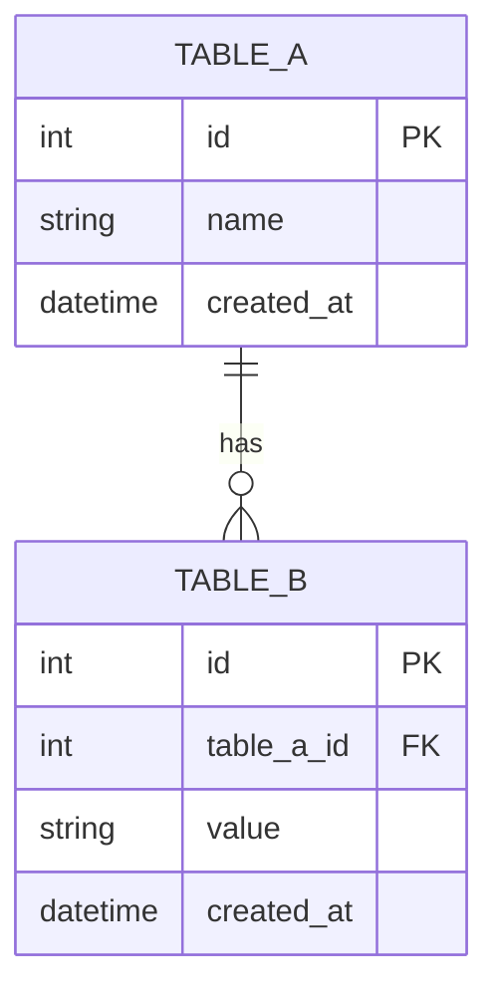

# ER図

```mermaid
erDiagram
  TABLE_A {
    int id PK
    string name
    datetime created_at
  }
  TABLE_B {
    int id PK
    int table_a_id FK
    string value
    datetime created_at
  }
  TABLE_A ||--o{ TABLE_B : has
```
